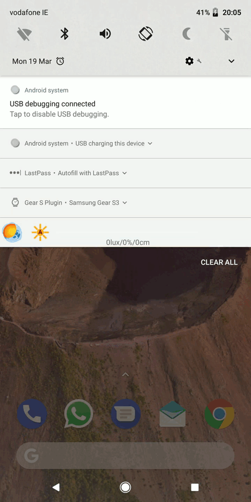
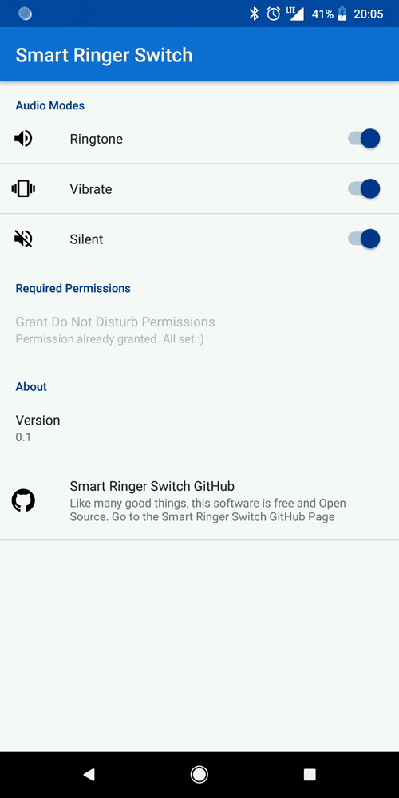

# Smart Ringer Switch

An Android quick settings ringer mode toggle.

Can be configured to switch between specific audio modes.

*TODO:* Adding geo-gating functionality to automatically switch ringer mode depending on the phones' physical location.